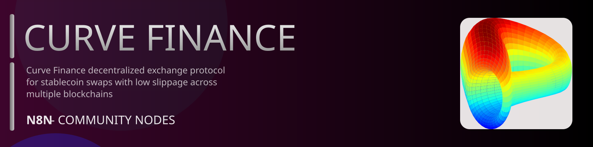

# @n8n-dev/n8n-nodes-curve-finance



[](https://www.npmjs.com/package/@n8n-dev/n8n-nodes-curve-finance)
[](https://opensource.org/licenses/MIT)

---

**Stop writing curve-finance API integrations by hand.**

Every time you connect n8n to curve-finance, you waste hours mapping endpoints, defining parameters, and debugging schemas. You copy-paste from docs, fix edge cases, and pray nothing breaks.

**What if connecting n8n to curve-finance took 5 minutes, not half a day?**

This node gives you **8+ resources** out of the box: **Gauges**, **Volumes And AP Ys**, **Crv USD**, **Deprecated**, **Misc**, and 3 more: with full CRUD operations, typed parameters, and zero manual configuration.

---

## What You Get

- **Zero boilerplate**: Resources, operations, and fields are pre-configured and ready to use
- **Full CRUD**: Create, read, update, and delete support where the API allows it
- **Typed parameters**: No more guessing field types
- **Built-in auth**: API key authentication, ready to go
- **Declarative**: Native n8n performance, no custom execute() overhead

---

## Install

```bash
npm install @n8n-dev/n8n-nodes-curve-finance
```

**Or in n8n:**
1. **Settings → Community Nodes → Install**
2. Search: `@n8n-dev/n8n-nodes-curve-finance`
3. Click **Install**

---

## Quick Start

1. Install the node (above)
2. Add credentials: **curve-finance API** → paste your API key
3. Drag the **curve-finance** node into your workflow
4. Pick a resource → pick an operation → done.

That's it. No configuration files. No code. It just works.

---

## Resources

<details>
<summary><b>Gauges</b> (1 operations)</summary>

- Get Get All Gauges

</details>

<details>
<summary><b>Volumes And AP Ys</b> (8 operations)</summary>

- Get Get All Gauges
- Get Get All Pools Volume
- Get Get Base Apys
- Get Get Facto Gauges Crv Rewards
- Get Get Factory AP Ys
- Get Get Subgraph Data
- Get Get Volumes
- Get Get Volumes Ethereum Crvusd Amms

</details>

<details>
<summary><b>Crv USD</b> (6 operations)</summary>

- Get Get Crv Circ Supply
- Get Get Crvusd Total Supply
- Get Get Crvusd Total Supply Number
- Get Get Scrvusd Total Supply Number
- Get Get Scrvusd Total Supply Result
- Get Get Volumes Ethereum Crvusd Amms

</details>

<details>
<summary><b>Misc</b> (5 operations)</summary>

- Get Get Gas
- Get Get Platforms
- Get Get Points Campaigns
- Get Get Registry Address
- Get Get Weekly Fees

</details>

<details>
<summary><b>Pools</b> (7 operations)</summary>

- Get Get Hidden Pools
- Get Get Pool List
- Get Get Pools
- Get Get Pools All
- Get Get Pools Big
- Get Get Pools Empty
- Get Get Pools Small

</details>

<details>
<summary><b>Lending</b> (2 operations)</summary>

- Get Get Lending Vaults
- Get Get Lending Vaults All

</details>

<details>
<summary><b>Tokens</b> (1 operations)</summary>

- Get Get Tokens All

</details>

---

## Why This Node?

**Without this node:**
- Hours of manual API integration
- Copy-pasting from curve-finance docs
- Debugging auth, pagination, error handling
- Maintaining your own client code

**With this node:**
- Install → configure → use. 5 minutes.
- Auto-generated from the official curve-finance OpenAPI spec
- Always up to date when the API changes
- Native n8n performance

---

## Auto-Generated
This node was auto-generated from the official **curve-finance** OpenAPI specification using
[@n8n-dev/n8n-openapi-node-ultimate](https://github.com/kelvinzer0/n8n-openapi-node-ultimate),
then validated against the live API so you get accurate types and real parameters, not guesswork.

When the curve-finance API updates, this node updates too.

---

## Support This Project

If this node saved you hours of work, consider supporting continued development, new APIs, better error handling, and faster updates.

[](https://n8n-code.github.io/membership/#/eyJ0aXRsZSI6IktlZXAgSXQgTW92aW5nIiwiZGVzYyI6Ik9uZSBkZXZlbG9wZXIgYnVpbHQgYSB0b29sIHRoYXQgYXV0by1nZW5lcmF0ZXNcbm44biBub2RlcyBmcm9tIGFueSBPcGVuQVBJIHNwZWMuXG5cbllvdXIgZG9uYXRpb24gZnVuZHMgbmV3IGZlYXR1cmVzLCBtb3JlIEFQSSBzdXBwb3J0LFxuYW5kIGJldHRlciB0b29saW5nIGZvciBldmVyeSBkZXZlbG9wZXIgYWZ0ZXIgeW91LiIsInRhcmdldCI6NTAwMCwiYWRkcmVzc2VzIjp7ImV0aGVyZXVtIjoiMHhmMDU1NWQ0MGRiRkI0ZTNCZjA3MDQ0MjgyQjc4RjJmRTFmNTFFZjcyIiwic29sYW5hIjoiNlpEVk5BYmpZZExEcXo4cGt3VUNHYllaNVV3QlFranB0QzU1Wk5vTFcybVUifSwiZGlzY29yZCI6Imh0dHBzOi8vZGlzY29yZC5nZy9wdERaOGU0aDkzIn0)

---

## License

MIT © [kelvinzer0](https://github.com/n8n-code)
